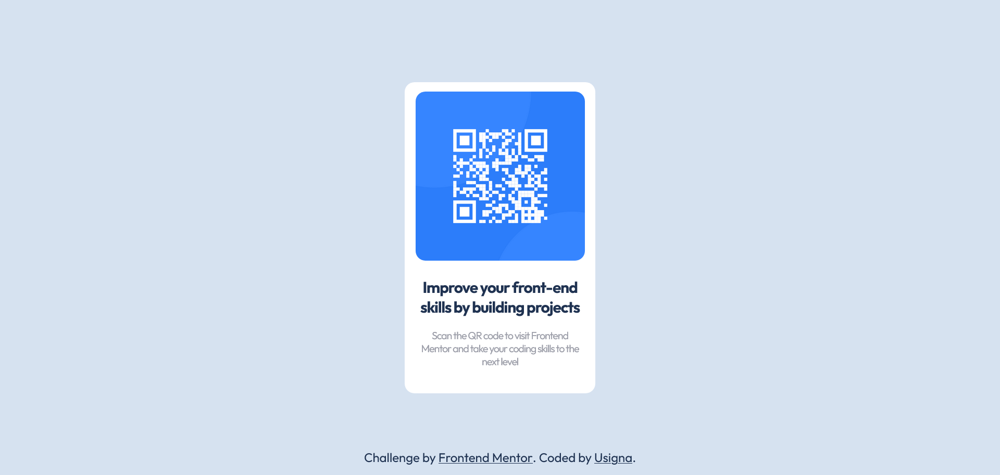

# Frontend Mentor - QR code component solution

This is a solution to the [QR code component challenge on Frontend Mentor](https://www.frontendmentor.io/challenges/qr-code-component-iux_sIO_H). Frontend Mentor challenges help you improve your coding skills by building realistic projects. 

## Overview

### Screenshot

### Links

- Solution URL: [https://github.com/usigna/qr-code-component](https://github.com/usigna/qr-code-component)
- Live Site URL: [https://usigna.github.io/qr-code-component/](https://usigna.github.io/qr-code-component/)

### Built with

- Semantic HTML5 markup
- Flexbox
- Mobile-first workflow

## Author

- Website - [GitHub](https://github.com/usigna)
- Frontend Mentor - [@usigna](https://www.frontendmentor.io/profile/usigna)
